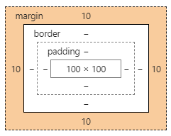

# CSS(Cascading Style Sheets)

# CSS 활용하기

### 01. CSS

1. 인라인 (수정이 어려우니 가능한 사용자제)

   ```html
   <p style="color: purple;">인라인 CSS 활용</p> 
   ```

2. Embedding (내부참조 - head 태그 내에 사용)

   ```html
   <style>
     h1 {
       color: red;
     }
   </style>
   ```

3. **link file (외부참조)**

   `01_sytle.css`

   ```css
   h1 {
     text-align: center;
   }
   ```

   `01_css.html`

   ```html
   <link rel="stylesheet" href="05_style.css">
   ```


### 02. Selector

1. 태그 선택자

   ```html
   h1 {
     color: red;
   }
   h3 {
     color: pink;
   }
   ```

2.  클래스 선택자

   ```html
   .blue {
     color: blue;
   }
   <h3 class="blue">클래스 선택자</h3>
   ```

3.  아이디 선택자

   ```html
   #green {
     color: green;
   }
   <h3 id="green">아이디 선택자</h3>
   ```

   * 선택자 우선 순위 :  id > class > tag (단, inline이 사용되었을 경우 inline 적용)
   * class는 문서에서 여러번 사용 가능 하지만 id는 문서에서 반드시 한번만 사용

4.  그룹 선택자

   ```css
   h1, h2, h3, h4, h5, h6, .darkolivegreen {
     color: darkolivegreen;
   }
   ```

   ```html
   <h1>그룹선택자 적용</h1>
     <p class="darkolivegreen">그룹선택자</p>
   ```

5.  인접 선택자

   ```css
   .blue + .red + div {
     background-color: purple;
   }
   ```

   * blue 클래스와 red 클래스 다음에 div를 사용했을 때

6. 자식 선택자

   ```css
   .parent > li {
     color: red;
   }
   ```

   * `class="parent"`인 부모 클래스 바로 밑의 `li` 태그에 적용

7. 후손 선택자

   ```css
   .ancestor li {
     color: blue;
   }
   ```

   * `class="ancestor"`인 부모 클래스 안의 모든 `li`태그에 적용

### 03. Unit

1. rem

   * root 요소의 배수
   * html : 16px (브라우저 기본)
   * ex) 2rem = 16 * 2px

2. em

   * 상위 요소의 배수

   * ex)

     ```html
     <ul>2em
         <li>2em</li>
     </ul>
     ```

     * ul -> 16(html)  *  2px
     * li -> 32(ul) * 2px

3. Viewport 단위 (글자와 div에서 모두 사용 가능)

   * vw : 화면 너비의 1/100만큼 크기가 변함
   * vh: 화면 높이의 1/100만큼 크기가 변함

4. 색상 표현 단위

   * rgb(r, g, b)
   * rgba(r, g, b, 투명도)
   * #000000 : rgb값을 16진수로 표현


### 04. Box model



1. Margin

   * 테두리 바깥의 외부 여백
   * 배경색 지정 불가능

   * shorthand1

     ```css
     .shorthand-1 {
       /* 상하좌우 모두 적용 */
       margin: 10px;
     }
     ```

   * shorthand2

     ```css
     .shorthand-2 {
       /* 상하 / 좌우 */
       margin: 10px 20px;
     }
     ```

   * shorthand3

     ```css
     .shorthand-3 {
       /* 상 / 좌우 / 하 */
       margin: 10px 20px 30px;
     }
     ```

   * shorthand4

     ```css
     .margin-shorthand-4 {
       /* 상 / 우 / 하 / 좌 (시계방향) */
       margin: 10px 20px 30px 40px;
     }
     ```

2. Border

   * 테두리 영역

   ```css
   .border {
     border-width: 2px;
     border-style: dotted;
     border-color: red;
     border-top-color: blue;
     /* radius를 사용하면 깍여나감 */
     border-radius: 50%;
   }
   ```

   * `border-radius` : 테두리를 깍을 수 있음 (50%일 때 원)

3. Padding

   * 테두리 안쪽 *내부* 여백

   * 요소에 적용된 배경의 컬러, 이미지는 패딩까지 적용

     ```css
     .padding {
       padding-top: 30px;
       padding-bottom: 30px;
     }
     ```

     * 내부 여백이 위 아래로 30px만큼 생김

### 05. Display

1. Block

   * 기본적으로 가질 수 있는 영역의 100% 차지

   * h1~h6, p, div, form, table, ol, ul, li

   * 가로 정렬

     ```css
     /* 왼쪽 정렬 */
     .ml-auto {
         margin-left: auto;
     }
     
     /* 가운데 정렬 */
     /* 상하 / 좌우 */
     .mx-auto {
         margin: 0 auto;
     }
     ```

2. Inline

   * content 영역만큼 너비를 가짐 (내용 없이 존재할 수 없음, width나 height 적용 불가)

   * margin을 가지고 있지 않음
   * span 태그는 inline 중 가장 기본적인 요소
   * span, input, a, img

3. Inline-block

   * block 속성 (width, height 적용) + inline 속성 (margin이 사라짐)

4. None

   * 공간이 사라짐

5. Visibility: hidden

   * 입력된 값은 없어지지만 공간은 남아있음


### 06. Position

1. Static
   * 기본이 되는 위치
2. Absolute
   * 부모 혹은 조상요소를 기준으로 위치 ( 가까운 조상 중 static이 아닌 요소)
   * 만약 모든 부모가 static인 경우 static 값에 기준
   * 부모가 static이 아닌 경우 해당 부모가 기준(부모의 위치가 바뀌면 따라감)
3. Relative
   * 자기가 원래 있어야할 위치(static)을 기준으로 이동
4. Fixed
   * 브라우저에 따라 위치가 변경되어 고정되어 보임